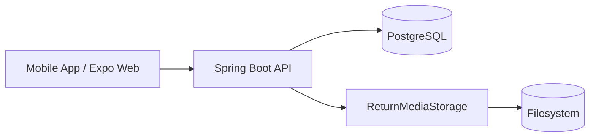

# ReturnFlow

A multi-tenant return-management platform for delivery and warehouse operations.

[](https://github.com/geisonbruno/return-flow/actions/workflows/backend.yml)
[](https://github.com/geisonbruno/return-flow/actions/workflows/web.yml)
[](https://github.com/geisonbruno/return-flow/actions/workflows/mobile.yml)


## About the project

Drivers currently record product returns through paper forms, photos, and WhatsApp explanations — a fragmented, hard-to-search process. ReturnFlow replaces it with one structured digital record per returned product: one customer, one product, one reason, one traceable lifecycle.

The project is an actively developed MVP, not a finished platform. The current implementation focuses on the **DRIVER** experience — authentication, return creation, and photos. Warehouse review, an admin web panel, and reporting are planned but not yet built.

## Current features

- Multi-tenant Spring Boot API with tenant isolation enforced on every query.
- JWT authentication with rotating refresh tokens and logout revocation.
- ADMIN-only route and driver-user administration.
- DRIVER-only mobile authentication and session restoration.
- Return creation with customer name, product name, quantity (`EA`/`CTN`), canonical return reasons, and observations.
- Driver-scoped return list and details — a driver sees only their own returns.
- Tenant and driver isolation enforced at the API layer, not just in the UI.
- Up to five optional, private return photos per return, with server-side JPEG validation.
- On-device JPEG normalization before upload.
- Expo Web support for local browser-based testing.
- Backend CI and Mobile CI on every push/PR to `main`.

Not implemented yet: customer signature, warehouse review, PDF generation, dashboards, billing, or deployment.

## Technology stack

| Backend | Mobile | Engineering |
|---|---|---|
| Java 21 | TypeScript | Docker |
| Spring Boot | React Native | GitHub Actions |
| Spring Security | Expo SDK 57 | Node.js 20.19.4 |
| Spring Data JPA | React Navigation | OpenAPI / Swagger |
| PostgreSQL | Expo SecureStore | |
| Flyway | Jest | |
| Testcontainers | React Native Testing Library | |
| Maven | | |

## Architecture



PostgreSQL stores structured return and photo metadata; image binaries never live in the database. The filesystem adapter is an MVP implementation behind a replaceable `ReturnMediaStorage` interface, so a durable object-storage backend can replace it later without changing calling code.

## Running locally

Start in order: PostgreSQL → API → mobile app.

```powershell
# 1. Infrastructure
docker compose -f infra/docker-compose.yml up -d

# 2. Backend
cd apps/api
$env:SPRING_PROFILES_ACTIVE="local"
.\mvnw.cmd spring-boot:run

# 3. Mobile
cd apps/mobile
npm ci
npx expo start
```

The backend requires an explicit profile and refuses to start without one. Mobile setup, Expo Go, and Expo Web details live in [`apps/mobile/README.md`](apps/mobile/README.md).

## Testing

```powershell
# Backend
cd apps/api
.\mvnw.cmd test
.\mvnw.cmd package

# Mobile
cd apps/mobile
npm test
npm run typecheck
npm run lint
```

## Building

```powershell
# Backend — runs the full test suite, then builds target/api-0.0.1-SNAPSHOT.jar
cd apps/api
.\mvnw.cmd package

# Web — production static assets in dist/
cd apps/web
npm ci
npm run lint; npm run typecheck; npm test; npm run build
```

Java 21 and the Maven Wrapper cover the backend, so no globally installed Maven is needed. No IDE is required for any build.

GitHub Actions runs three independent, path-filtered workflows on every Pull Request to `main` — **Backend CI**, **Web CI**, and **Mobile CI** — so a change to one application does not run the others' checks.

Toolchain versions, build outputs, and every environment variable each application reads are documented in [`docs/BUILD_AND_ENVIRONMENT.md`](docs/BUILD_AND_ENVIRONMENT.md). No secret is ever committed, and CI requires none.

## Roadmap

**Completed**: backend and multi-tenant foundation, authentication and administration, DRIVER return workflow, product identification, private return photos, CI and Pull Request governance.

**Next**: customer signature.

**Later**: warehouse review, management web panel, PDF generation, reporting, deployment and object storage.

## Project status and documentation

ReturnFlow is a private, actively developed MVP — not production-ready and not yet publicly licensed.

- [`apps/mobile/README.md`](apps/mobile/README.md) — mobile setup and manual walkthrough
- [`docs/IMPLEMENTATION_PLAN.md`](docs/IMPLEMENTATION_PLAN.md) — phase-by-phase roadmap and acceptance criteria
- [`docs/DEVELOPMENT_WORKFLOW.md`](docs/DEVELOPMENT_WORKFLOW.md) — branching, CI, and release process
- [`docs/BUILD_AND_ENVIRONMENT.md`](docs/BUILD_AND_ENVIRONMENT.md) — build commands, toolchain versions, and environment variables
- [`PROGRESS.md`](PROGRESS.md) — current implementation status
