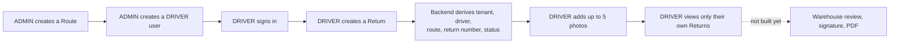
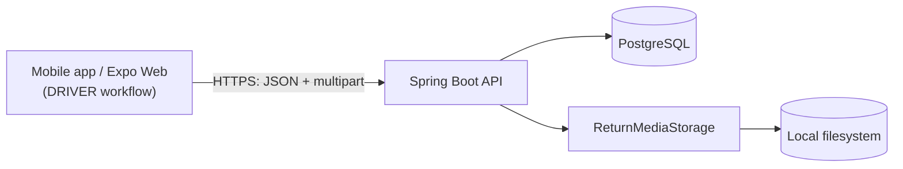

# ReturnFlow

Multi-tenant return-management platform for delivery and warehouse operations.

ReturnFlow is an actively developed MVP. It replaces a paper-based product-return form — handwritten by a driver, signed by a customer, and later re-explained to a warehouse over WhatsApp — with one traceable digital record per returned product.

[](https://github.com/geisonbruno/return-flow/actions/workflows/ci.yml)


The `CI` badge covers both required jobs defined in [`ci.yml`](.github/workflows/ci.yml) — **Backend CI** and **Mobile CI** — since GitHub Actions reports one status per workflow file, not per job.

## Product overview

A ReturnFlow return always represents exactly one customer, one product, one quantity, and one reason — never a multi-item shipment. If a customer returns three products, that creates three independent, separately trackable return records.

The full intended lifecycle is:

```text
WAITING_WAREHOUSE → IN_REVIEW → CLOSED
                              ↘ CANCELLED
```

**The current implementation primarily covers the DRIVER side of this lifecycle**: authentication, tenant/user/route administration, and the mobile app for creating a return and attaching photos. It does not yet implement warehouse review, status transitions beyond creation, a web admin panel, or PDF generation — see [Current capabilities](#current-capabilities) and [Current limitations](#current-limitations) for the exact boundary.

## The problem it solves

The paper process it replaces has several concrete failure modes:

- handwriting is sometimes incomplete or illegible;
- photos and explanations end up scattered across paper and chat apps;
- the same customer name is rewritten for every separate product;
- past returns are hard to search;
- there's no reliable record of who is reviewing what;
- driver-facing and warehouse-facing responsibilities are mixed on one sheet;
- return reasons are free text, making later reporting inconsistent.

ReturnFlow digitizes the underlying workflow rather than copying the paper layout.

## Current capabilities

**Backend (`apps/api`)**

- Multi-tenant PostgreSQL schema with tenant isolation enforced on every tenant-owned query.
- Idempotent startup bootstrap of the default `Warehouse` tenant and (when `BOOTSTRAP_ADMIN_*` env vars are set) the first admin user.
- Email/password authentication: short-lived JWT access tokens, rotating refresh tokens, logout revocation, and role/tenant claims derived only from trusted server-side data.
- Role-based access control (`DRIVER`, `ADMIN`) enforced at the API layer, independent of any client UI.
- Admin-only route management (`/api/v1/admin/routes`) and user management (`/api/v1/admin/users`), including driver-route assignment and password reset — no hard deletion.
- Driver-only return creation, listing, and detail retrieval (`/api/v1/driver/returns`), fully tenant- and driver-scoped.
- Server-derived tenant, driver, route (snapshotted at creation time), return number (`RF-000001` style), and initial status — never accepted from the client.
- Required `productName`, `quantity`, `unit` (`EA`/`CTN`), and the canonical 11-value return-reason set from `CLAUDE.md`, with `reasonDetails` required only when the reason is `OTHER`.
- Zero-to-five JPEG photos per return (`/api/v1/driver/returns/{returnId}/photos`), validated by content and size on the server, safe under concurrent uploads, retrievable only through an authenticated endpoint.
- GitHub Actions CI (`Backend CI`, `Mobile CI`) required on every push/PR to `main`.

**Mobile (`apps/mobile`)** — the DRIVER-only workflow:

- Login, secure session restoration, and logout, with tokens in Expo SecureStore on native.
- My Returns: a driver's own returns only.
- Create Return, including product name, quantity/unit, reason (with conditional `OTHER` details), and an optional observation.
- Return Details (read-only).
- Add up to five photos per return, immediately after creation or later from Return Details — library selection, camera capture (native only), on-device JPEG normalization before upload, upload retry.
- `npx expo start --web` runs locally for browser-based development testing, alongside native.

**Not yet implemented**: customer signature, warehouse review, status transitions beyond creation, an admin/warehouse web panel, PDF generation, dashboards, notifications, billing, or ERP integration. `apps/web` currently contains only the unmodified Vite/React/TypeScript scaffold from Phase 0 — no product screens exist there yet.

## User roles and current workflow

Two roles are defined for V1: **DRIVER** (mobile app, own returns only) and **ADMIN** (route/user administration today; warehouse review is planned but not yet built).



## Architecture

- **API**: Spring Boot (Java 21) REST backend, exposing `/api/v1/**`.
- **Mobile**: React Native + Expo (driver-only today).
- **Database**: PostgreSQL, schema managed exclusively by Flyway migrations; Hibernate is configured to validate the schema, never mutate it.
- **Tests**: Testcontainers spins up a real, ephemeral PostgreSQL for backend integration tests — no H2 substitute.
- **Auth**: stateless JWT access tokens plus rotating refresh tokens; tenant context is derived only from the authenticated principal, never from client input.
- **Media storage**: return photos are stored as metadata in PostgreSQL plus binary content on the filesystem, behind a small `ReturnMediaStorage` interface — see [Media storage](#media-storage) below.
- **CI**: GitHub Actions runs Backend CI and Mobile CI on every push/PR to `main`; it is a build-time gate, not a runtime component of the application.



`infra/docker-compose.yml` also provisions a local MinIO instance for future object-storage work, but the application does not use it yet — photo storage currently goes through the filesystem adapter described below.

## Technology stack

**Backend**

| Component | Choice |
|---|---|
| Language | Java 21 |
| Framework | Spring Boot 4.1 (Web, Security, Data JPA, Validation, Actuator) |
| Database | PostgreSQL |
| Migrations | Flyway |
| Auth | `jjwt` (HS256 JWT) |
| API docs | springdoc-openapi (OpenAPI 3 / Swagger UI) |
| Integration tests | Testcontainers (PostgreSQL) |
| Build | Maven Wrapper |

**Mobile**

| Component | Choice |
|---|---|
| Language | TypeScript (strict) |
| Framework | React Native + Expo SDK 57 |
| Navigation | React Navigation (`@react-navigation/native` + `native-stack`) |
| Secure storage | Expo SecureStore (native) |
| Media | `expo-image-picker`, `expo-image-manipulator` |
| Testing | Jest (`jest-expo` preset) + React Native Testing Library |

**Dev / quality tooling**

| Component | Choice |
|---|---|
| Containers | Docker (PostgreSQL + MinIO locally) |
| CI | GitHub Actions |
| Node version | 20.19.4 (`apps/mobile/.nvmrc`) |
| Package manager | npm |
| Mobile dependency health | Expo Doctor (manual check — see [Testing and validation](#testing-and-validation)) |

## Repository structure

```text
returnflow/
├── apps/
│   ├── api/      Spring Boot backend — the only implemented server-side application
│   ├── web/      Admin console scaffold (Vite + React + TypeScript) — no product screens yet
│   └── mobile/   Driver app (React Native + Expo) — the current DRIVER workflow
├── docs/         Implementation plan, development workflow, diagrams
├── infra/        Local Docker Compose infrastructure (PostgreSQL + MinIO)
├── .github/      CI workflow and Pull Request template
└── PROGRESS.md   Current implementation state (phase-by-phase)
```

Each app has independent dependencies, build/lint/test commands, and deploys independently — this is one product in one repository, not a shared build.

## Getting started

### Prerequisites

- Git
- Java 21 (Temurin recommended)
- Node.js 20.19.4 (`apps/mobile/.nvmrc` — an Expo Go install must be a version compatible with Expo SDK 57)
- npm
- Docker Desktop or another Docker-compatible runtime
- Expo Go (on a physical device, matching Expo SDK 57) or a browser, for `npx expo start --web` — no physical device is required to try the app.

### Environment configuration

**Infrastructure** (`infra/.env`, optional — copy from [`infra/.env.example`](infra/.env.example)):

```text
POSTGRES_DB=returnflow
POSTGRES_USER=returnflow
POSTGRES_PASSWORD=returnflow
POSTGRES_PORT=5433
```

**Backend** (`apps/api` has no `.env` file — set these as environment variables or via `application-local.properties`):

```text
SPRING_PROFILES_ACTIVE=local
BOOTSTRAP_ADMIN_EMAIL=admin@example.local
BOOTSTRAP_ADMIN_PASSWORD=change-me-locally
BOOTSTRAP_ADMIN_NAME=Local Admin
```

`BOOTSTRAP_ADMIN_*` are all unset by default, which safely disables the first-admin bootstrap; set all three together to enable it. `RETURN_MEDIA_STORAGE_ROOT` may optionally override where uploaded photos are stored on disk (defaults to `~/.returnflow/media`, outside the repository).

**Mobile** (`apps/mobile/.env`, copy from [`apps/mobile/.env.example`](apps/mobile/.env.example)):

```text
EXPO_PUBLIC_API_BASE_URL=http://localhost:8080
```

`localhost` only works for a browser, emulator, or simulator running on the same machine as the API. A physical phone cannot reach the laptop through `localhost` — use the laptop's LAN IP instead (e.g. `http://192.168.1.23:8080`), with both devices on the same Wi-Fi network.

### Running locally (PowerShell)

Start components in this order: database → backend → mobile.

**1. Infrastructure**

```powershell
docker compose -f infra/docker-compose.yml up -d
```

**2. Backend**

```powershell
cd apps/api
$env:SPRING_PROFILES_ACTIVE="local"
.\mvnw.cmd spring-boot:run
```

Runs at `http://localhost:8080`. The app refuses to start without an explicit profile, so it never connects to an undefined database.

**3. Mobile**

```powershell
cd apps/mobile
npm ci
npx expo start
```

Scan the QR code with Expo Go, or run in a browser instead:

```powershell
npx expo start --web
```

Expo Web runs at `http://localhost:8081` and talks to the API at `http://localhost:8080`; the backend's `local` profile allows exactly that browser origin via CORS.

### Testing and validation

**Backend**:

```powershell
cd apps/api
.\mvnw.cmd test      # full test suite (Testcontainers-backed PostgreSQL)
.\mvnw.cmd package    # runs tests, then packages
```

**Mobile**:

```powershell
cd apps/mobile
npm test
npm run typecheck
npm run lint
npx expo-doctor
```

`npm test`, `npm run typecheck`, and `npm run lint` are all required, CI-blocking checks. `npx expo-doctor` is a manual maintenance check — it currently reports **17/18** due to a known, diagnosed dependency-version drift (see [`docs/DEVELOPMENT_WORKFLOW.md`](docs/DEVELOPMENT_WORKFLOW.md) and `PROGRESS.md`); it is intentionally not part of CI, and this status is not hidden.

## API documentation

With the backend running locally:

- Swagger UI: `http://localhost:8080/swagger-ui.html`
- OpenAPI JSON: `http://localhost:8080/v3/api-docs`

Major endpoint groups (see Swagger UI for the full request/response contract):

- `POST/GET /api/v1/auth/*` — login, refresh, logout, current user
- `GET/POST/PUT /api/v1/admin/routes*` — ADMIN-only route management
- `GET/POST/PUT /api/v1/admin/users*` — ADMIN-only user management
- `GET/POST /api/v1/driver/returns*` — DRIVER-only return creation, listing, and detail
- `GET/POST /api/v1/driver/returns/{returnId}/photos*` — DRIVER-only photo upload, listing, and authenticated content retrieval

## Media storage

Return photos are split across two stores:

- **PostgreSQL** holds only metadata (content type, size, position, timestamps).
- **Binary image bytes live outside PostgreSQL**, behind a small `ReturnMediaStorage` interface (store/read by a server-generated key).

The current implementation, `FilesystemReturnMediaStorage`, writes to a configured local directory — a deliberate MVP choice, suitable for local development. **It is not durable in a deployed environment**: a typical container filesystem is ephemeral, so production use requires either a mounted persistent volume or replacing this adapter with a Cloudflare R2/S3-compatible implementation of the same interface — no calling code would need to change. `infra/docker-compose.yml` provisions a local MinIO instance for this future work, but no code path uses it yet.

Photo content is only ever reachable through an authenticated API request — never a public URL, and never a token in a query string.

## Security and multi-tenancy

- Authentication is JWT-based: a short-lived access token plus a rotating refresh token; logout revokes the refresh-token session.
- Tenant context for every protected request is derived from the authenticated principal — never from request JSON, query parameters, or headers.
- Role-based authorization (`DRIVER`, `ADMIN`) is enforced server-side, independent of client UI.
- A driver can only ever see their own returns; a cross-driver or cross-tenant lookup behaves as not found rather than forbidden, to avoid confirming another tenant's data exists.
- Clients can never choose a tenant ID, driver ID, route, return number, status, or photo position — all of these are server-derived.
- Native (iOS/Android) sessions are stored in Expo SecureStore. The Expo Web development build stores tokens in browser `localStorage` instead, since SecureStore has no browser implementation — this is a development convenience, not equivalent security, and does not affect native builds.

No formal security audit or penetration test has been performed.

## Development workflow

All work reaches `main` through a reviewed Pull Request off a `feat`/`fix`/`chore`/`docs` branch, gated by required `Backend CI` and `Mobile CI` checks. See [`docs/DEVELOPMENT_WORKFLOW.md`](docs/DEVELOPMENT_WORKFLOW.md) for the full branch-naming, review, and release process. CI passing verifies executable quality — it does not replace human product and architecture review before a commit is created or a PR is merged.

## Roadmap

**Completed**: backend foundation, tenant/authentication foundation, route and user administration, return domain model and driver API, mobile driver workflow, product-name correction, return photos, CI and repository governance.

**Next**: Phase 5B — customer signature.

**Later** (planned, not committed to a specific order or date): warehouse review workflow, admin/warehouse web panel, PDF generation, operational dashboard, deployment and object storage, and — only after pilot validation — self-service SaaS onboarding and billing.

See [`docs/IMPLEMENTATION_PLAN.md`](docs/IMPLEMENTATION_PLAN.md) for full phase-by-phase scope and acceptance criteria, and `PROGRESS.md` for current status.

## Current limitations

These are deliberate MVP boundaries, not oversights:

- No customer signature capture yet (planned next, Phase 5B).
- No warehouse review workflow or web admin panel — `apps/web` is still the unmodified Phase 0 scaffold.
- Photo storage is filesystem-based and not durable in a deployed environment without a persistent volume (see [Media storage](#media-storage)).
- No remote authenticated photo thumbnails yet in the mobile app — only local, not-yet-uploaded previews render today.
- Mobile dependency alignment is incomplete: Expo Doctor reports 17/18, tracked as a known issue, not part of CI.
- No production deployment pipeline exists yet.
- No product catalog or SKU integration — product identity is free text.
- No photo delete or replace capability.

## Versioning and releases

No release has been tagged yet. The intended scheme (see `docs/DEVELOPMENT_WORKFLOW.md`): `v0.1.0` at the first real pilot, semantic versioning for patches and features afterward, and `v1.0.0` reserved for the first version considered stable beyond the initial pilot.

## License and repository status

This repository is currently maintained as a private MVP project. Usage and distribution terms have not yet been published.
