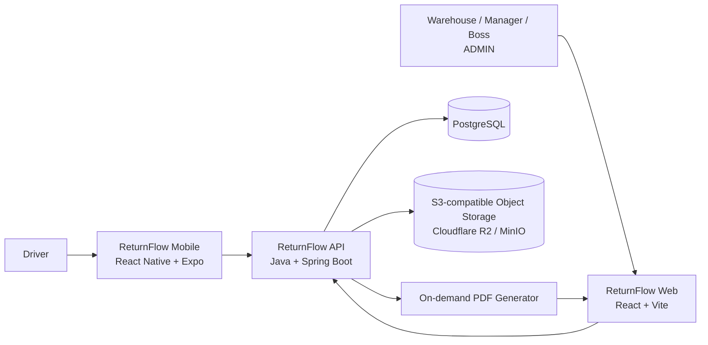
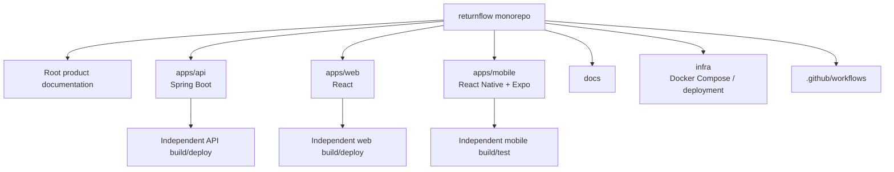
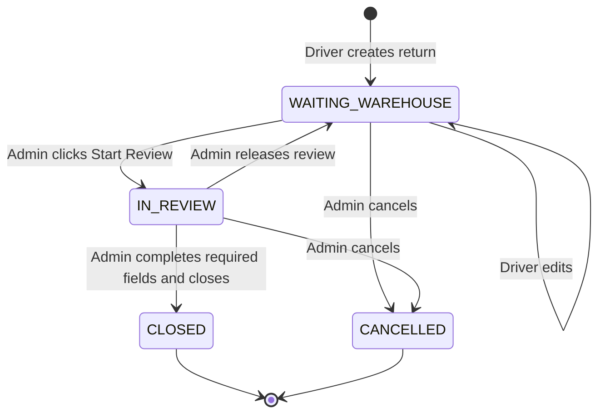
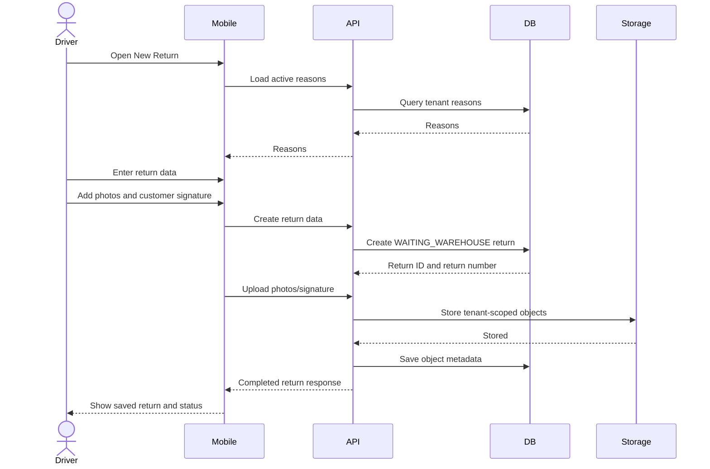
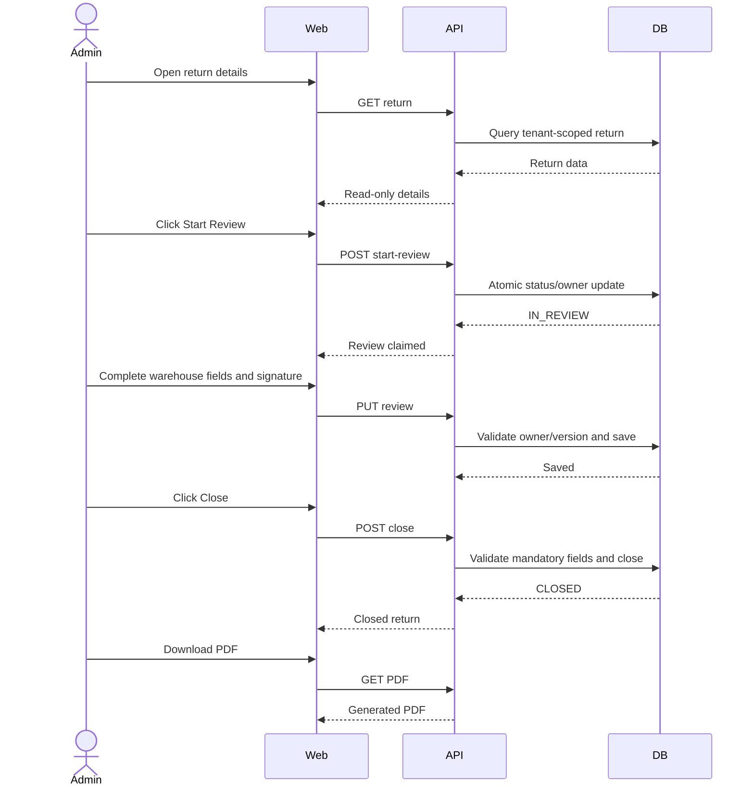
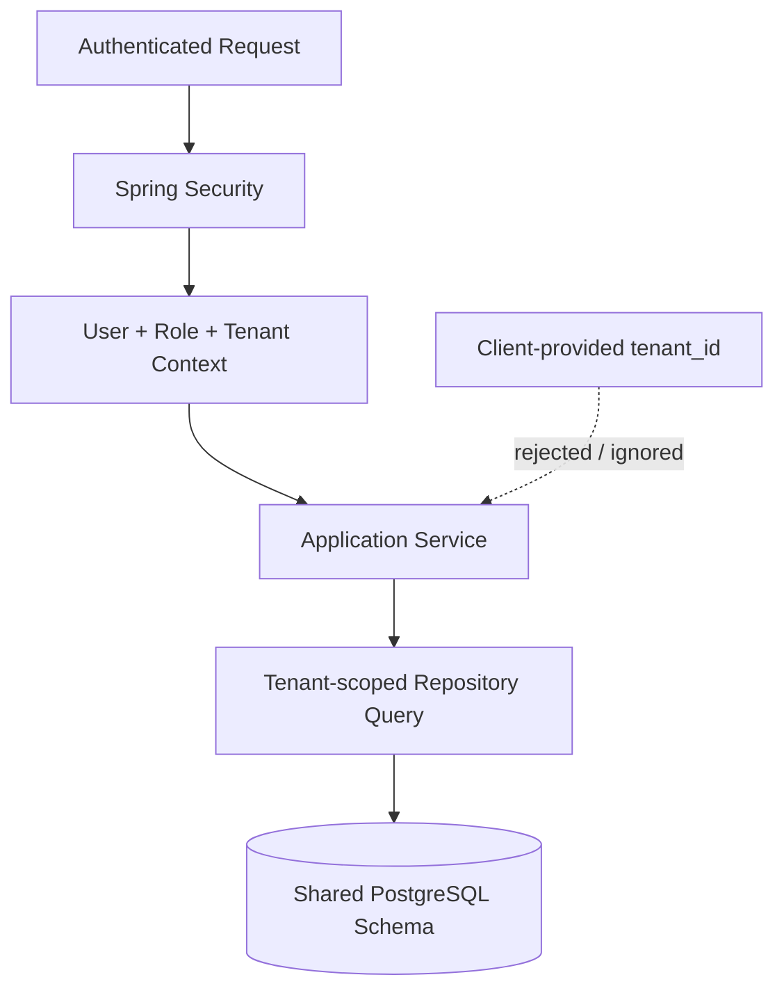
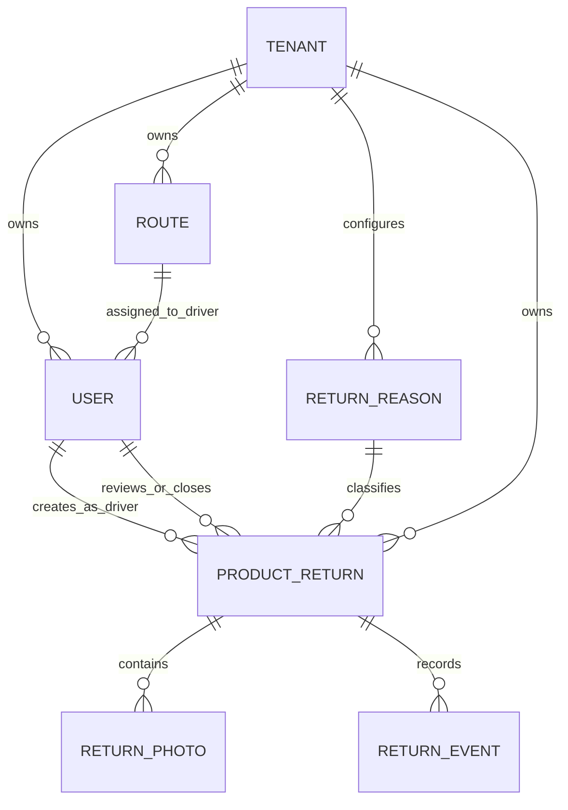
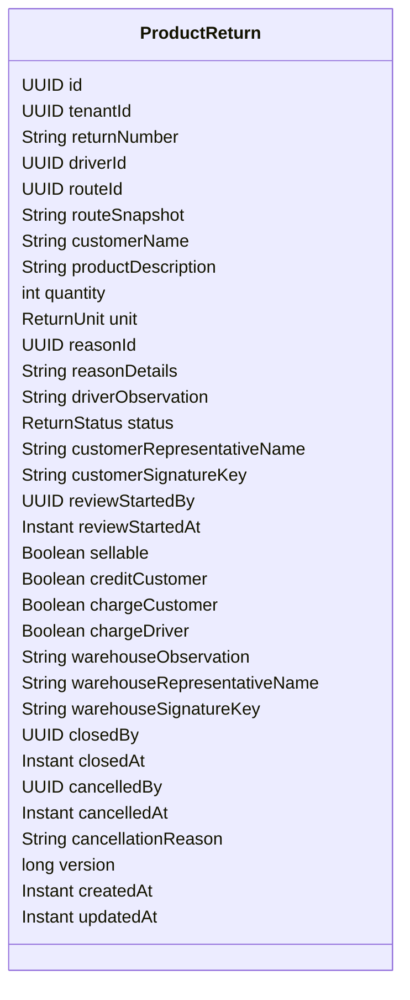
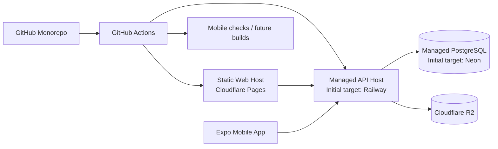

# ReturnFlow Diagrams

These diagrams describe the agreed V1 architecture and workflow.

## 1. System context

## 2. Monorepo structure

## 3. Return lifecycle

## 4. Driver create flow

## 5. Warehouse review flow

## 6. Tenant isolation

## 7. Domain relationships

## 8. Main ProductReturn fields

## 9. Deployment target

Provider pricing and free-tier limits must be revalidated before deployment.
